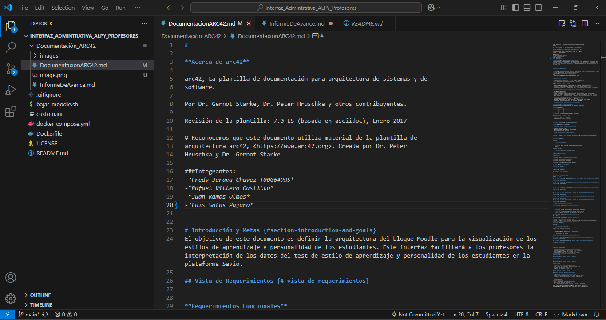
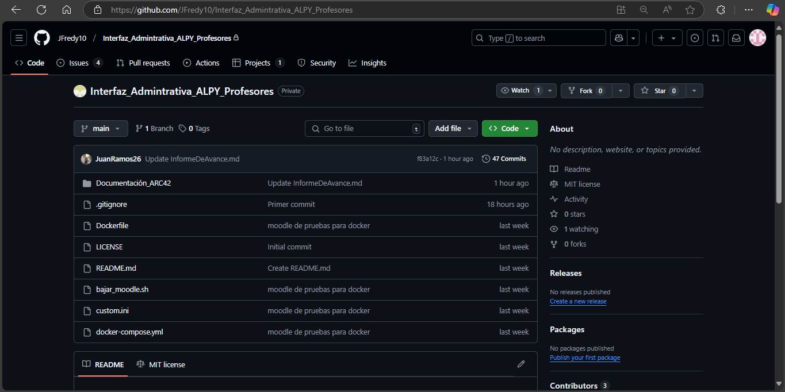
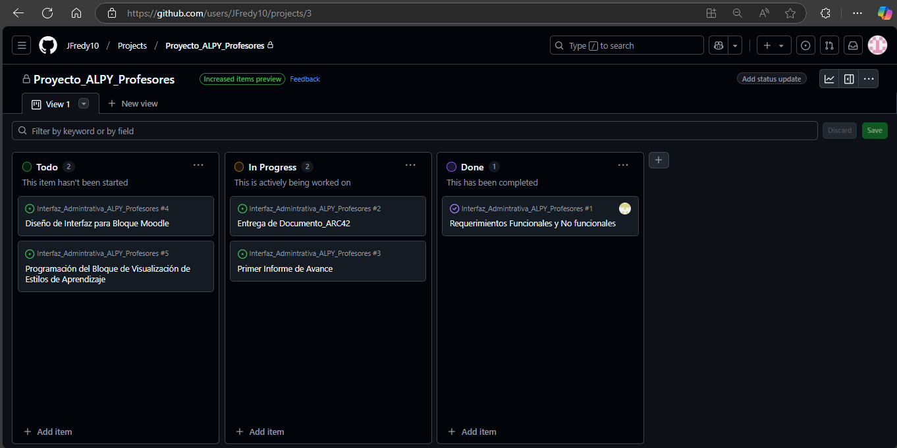

# Informe del Proyecto

## Integrantes del Equipo

1. Rafael Villero Castillo 
2. Fredy jarava chavez
3. Juan David Ramos Olmos
4. Luis Felipe Salas 

---

## Evidencias de Configuración del Entorno

### Integrante 1

### Integrante 2

#### Instalacion

*Entorno de Desarrollo Local*

*DOCKER*

*Instalacion de Moodle*

#### Interfaz Moodle

### Integrante 3

*Entorno de Desarrollo Local*

---

## Evidencia de Creación del Repositorio, Proyecto y Tareas en GitHub

*Desarrollo del Block en Visual Studio*

### Repositorio
- *Nombre del repositorio*: Interfaz_Admintrativa_ALPY_Profesores
- *URL*: https://github.com/JFredy10/Interfaz_Admintrativa_ALPY_Profesores.git

### Integrante 4

*Entorno local*

*GitHub*

*GitHub repositorio*
